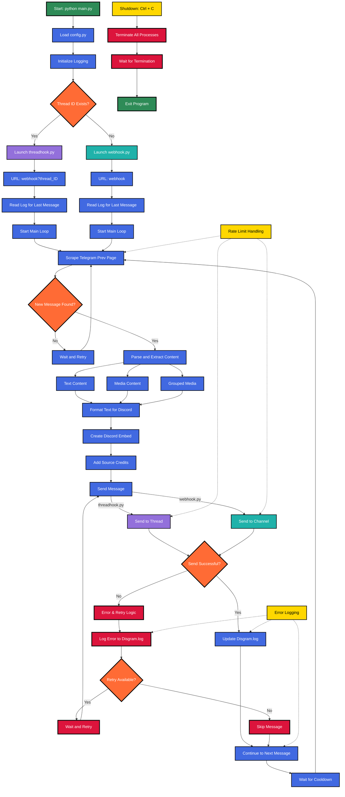

# Disgram

A Python-based tool to forward messages from public Telegram channels to Discord using webhooks embeds. Disgram scrapes Telegram's public preview pages and forwards messages, including text, images, and formatted content, to Discord channels through webhooks.

## Workflow


## Features

- No Telegram or Discord Bots required
- Forward messages from multiple Telegram channels to Discord
- Automated message source crediting in embeds
- Preserve message formatting (bold, italic, links, code blocks, etc.)
- Support for text and media content
- Support for text and media content
- Automatic handling of missing messages
- Robust error handling and retry mechanisms
- Rate limit compliance for both Telegram and Discord
- Detailed logging system and health monitoring endpoint (`/health`)

## Prerequisites

- Python 3.6 or higher
- Discord Webhook URL
- Public Telegram Channel links

## Installation

1. Clone the repository:
    ```
    git clone https://github.com/SimpNick6703/Disgram.git
    cd Disgram
    ```

2. Install the required dependencies:
    ```
    pip install -r requirements.txt
    ```

## Configuration

- Copy `.env.example` to `.env` and fill in the required environment variables:
    ```
    cp .env.example .env
    ```
  - `DISCORD_WEBHOOK_URL`: Your Discord webhook URL.
  - `DISCORD_THREAD_ID` (Optional): The ID of the Discord thread to send messages to.
  - `TELEGRAM_CHANNELS`: Comma-separated list of public Telegram channel URLs.

- Open `config.py` and modify the following:
  - Adjust `COOLDOWN` if needed (Suggested 300s or more).
  - Customize `EMBED_COLOR` and `ERROR_PLACEHOLDER` if desired.

> [!TIP]
> To send messages to a Thread under the channel of the webhook, replace `THREAD_ID = None` as `THREAD_ID = {thread_id}` in `config.py`.
>
> (Optional but recommended) Initialize `Disgram.log` with specific message IDs to start forwarding from particular message link.

## Usage

1. Start the bot:
    ```
    python main.py
    ```
2. The bot will create separate processes for each channel and begin forwarding messages.
3. To stop the bot, press `Ctrl + C`.

## Logging

The bot maintains logs in `Disgram.log` with the following information:
- Error messages
- New message notifications
- Operational status updates

## Health Monitoring

The bot includes a health check endpoint at `/health` for monitoring:
- **URL**: `http://localhost:5000/health` (or your server's address)
- **Method**: GET
- **Returns**: JSON with health status
- **Status Codes**: 
  - `200` - All systems healthy
  - `500` - Issues detected (check logs for details)

## Notes

- Respect Telegram's rate limits by keeping appropriate cooldown times to avoid IP bans from Telegram
- Messages are fetched from Telegram's public preview page (https://t.me/s/{channel})
- The bot only works with public Telegram channels with an accessible preview page.
- Discord webhook rate limits are handled automatically.

## Known Issues
- Image quality of compressed images is too low to scrap from preview page. Use Telegram app for higher quality.
- Video URL extraction depends on video size, which determines if the Telegram public preview page will preview the video or not. If the video is too large, it won't be previewed and thus can't be scraped.
- The bot can not fully parse messages reliably with following content for now:
  - Uncompressed Media
  - Documents
  - Messages with replies

## Contributing

Contributions are welcome! Please feel free to submit a Pull Request.

## License

This project is licensed under the MIT License - see the LICENSE file for details.