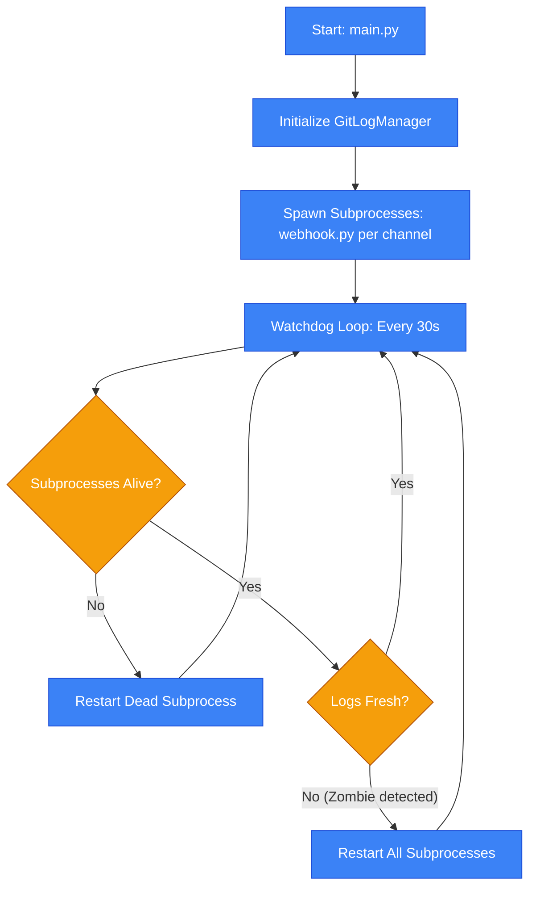
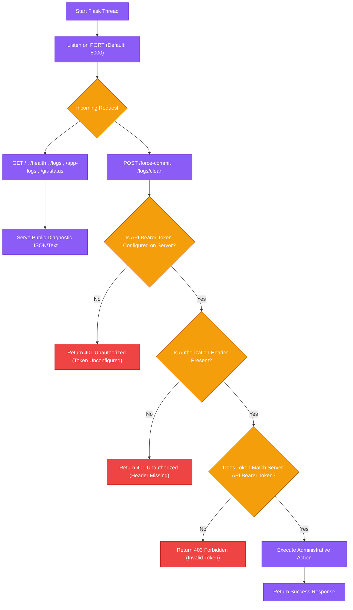

# Disgram

A Python-based application that scrapes public Telegram channel preview pages (`https://t.me/s/{channel}`) and forwards messages—including text, images, videos, audio, and documents—to Discord channels using Discord's modern **Components V2 (Layouts)** system.

It features best-available quality media extraction powered by **Telethon (MTProto)** with automatic fallback to web scraping, native process management for scraping multiple channels concurrently, a Flask health/status server with Bearer Token authentication, and built-in automatic Git log persistence using either Personal Access Tokens (PATs) or GitHub Apps.

---

## Core Architecture

Disgram uses a master-worker process structure. The master process runs a status watchdog and a Flask API server, while spawning isolated worker subprocesses for each scraped Telegram channel.

### 1.1 Process Management & API Server

The process management and administrative API server architecture is split into two focused diagrams below:

#### 1.1.1 Subprocess Management & Watchdog Architecture


```mermaid
graph TD
    Start[Start: main.py] --> InitGit[Initialize GitLogManager]
    InitGit --> SpawnBots[Spawn Subprocesses: webhook.py per channel]
    SpawnBots --> WatchdogLoop["Watchdog Loop: Every 30s"]
    
    WatchdogLoop --> CheckHealth{"Subprocesses Alive?"}
    CheckHealth -- No --> RestartDead[Restart Dead Subprocess]
    RestartDead --> WatchdogLoop
    
    CheckHealth -- Yes --> CheckZombies{"Logs Fresh?"}
    CheckZombies -- No (Zombie detected) --> RestartAll[Restart All Subprocesses]
    RestartAll --> WatchdogLoop
    CheckZombies -- Yes --> WatchdogLoop

    classDef proc fill:#3b82f6,stroke:#1d4ed8,color:#fff
    classDef decis fill:#f59e0b,stroke:#b45309,color:#fff
    class Start,InitGit,SpawnBots,WatchdogLoop,RestartDead,RestartAll proc
    class CheckHealth,CheckZombies decis
```

#### 1.1.2 Flask API Server Architecture


```mermaid
graph TD
    StartFlask[Start Flask Thread] --> ListenPort["Listen on PORT (Default: 5000)"]
    ListenPort --> HandleRequest{Incoming Request}
    
    HandleRequest --> GET_Routes["GET / , /health , /logs , /app-logs , /git-status"]
    GET_Routes --> ReturnData[Serve Public Diagnostic JSON/Text]
    
    HandleRequest --> POST_Routes["POST /force-commit , /logs/clear"]
    POST_Routes --> CheckConfig{"Is API Bearer Token Configured on Server?"}
    
    CheckConfig -- No --> Return401Unconfig["Return 401 Unauthorized (Token Unconfigured)"]
    CheckConfig -- Yes --> CheckHeader{"Is Authorization Header Present?"}
    
    CheckHeader -- No --> Return401Missing["Return 401 Unauthorized (Header Missing)"]
    CheckHeader -- Yes --> VerifyToken{"Does Token Match Server API Bearer Token?"}
    
    VerifyToken -- No --> Return403Forbidden["Return 403 Forbidden (Invalid Token)"]
    VerifyToken -- Yes --> ExecAdmin[Execute Administrative Action]
    
    ExecAdmin --> ReturnSuccess[Return Success Response]

    classDef flask fill:#8b5cf6,stroke:#6d28d9,color:#fff
    classDef decis fill:#f59e0b,stroke:#b45309,color:#fff
    classDef err fill:#ef4444,stroke:#b91c1c,color:#fff
    
    class StartFlask,ListenPort,GET_Routes,POST_Routes,ReturnData,ExecAdmin,ReturnSuccess flask
    class HandleRequest,CheckConfig,CheckHeader,VerifyToken decis
    class Return401Unconfig,Return401Missing,Return403Forbidden err
```

---

### 1.2 Scraper & Message Forwarding Pipeline

Each channel worker scrapes content from Telegram and forwards it via Discord Layouts with Telethon integration and fallback capabilities.


```mermaid
graph TD
    Startbot[Start Subprocess] --> ScraperLoop[Scraper Loop]
    ScraperLoop --> FetchTG[Fetch Public Telegram Preview via HTTP]
    FetchTG --> ParseTG{"New Message Found?"}
    ParseTG -- No --> Cooldown[Wait Cooldown]
    Cooldown --> FetchTG
    
    ParseTG -- Yes --> CheckTelethon{"Telethon Configured on Boot?"}
    
    CheckTelethon -- Yes --> FetchTelethon["Fetch Best-Available Media & Documents via Telethon"]
    FetchTelethon --> MediaSuccess{"Telethon Download Succeeded?"}
    
    MediaSuccess -- Yes --> ProcessTelethonMedia["Process Telethon Items (Spoilers, MIME Types)"]
    
    CheckTelethon -- No --> HTMLFallback["Fallback: Download Web Preview Media Concurrently"]
    MediaSuccess -- No --> HTMLFallback
    
    HTMLFallback --> ProcessHTMLMedia["Process Web Preview Items"]
    
    ProcessTelethonMedia --> BuildLayout["Build Discord Component V2 Layout"]
    ProcessHTMLMedia --> BuildLayout
    
    BuildLayout --> SeparateComponents{"Categorize Attachments"}
    SeparateComponents --> MediaGalleryItems["Images & Videos -> MediaGallery"]
    SeparateComponents --> FileComponents["Documents & Audio -> ui.File"]
    
    MediaGalleryItems --> ContainerBuild["Assemble Container & LayoutView"]
    FileComponents --> ContainerBuild
    
    ContainerBuild --> SendWebhook[Send Webhook Message]
    
    SendWebhook --> Success{"Send Successful?"}
    Success -- Yes --> UpdateLog[Update Disgram.log with Marker]
    UpdateLog --> Cooldown
    
    Success -- No (Payload Too Large 413) --> ApplyFallback[Targeted Video Fallback]
    ApplyFallback --> LoopMedia[Iterate Downloaded Media]
    LoopMedia --> ExcludeVideos{"Is Video & Size > 10MB?"}
    ExcludeVideos -- Yes --> DownloadThumb[Download Thumbnail & Re-upload to Discord]
    ExcludeVideos -- No --> KeepAttachment[Keep as File Attachment]
    DownloadThumb --> BuildFallbackLayout[Build Fallback Layout]
    KeepAttachment --> BuildFallbackLayout
    BuildFallbackLayout --> RetryWebhook[Retry Send Webhook]
    
    RetryWebhook --> SuccessFallback{"Retry Successful?"}
    SuccessFallback -- Yes --> UpdateLog
    SuccessFallback -- No --> PlainTextFallback[Final Plain Text Fallback]
    PlainTextFallback --> SuccessFinal{"Final Retry Successful?"}
    SuccessFinal -- Yes --> UpdateLog
    SuccessFinal -- No --> LogError[Log Error]
    LogError --> Cooldown

    classDef loop fill:#10b981,stroke:#047857,color:#fff
    classDef decis fill:#f59e0b,stroke:#b45309,color:#fff
    classDef fallback fill:#ef4444,stroke:#b91c1c,color:#fff
    classDef telethon fill:#8b5cf6,stroke:#6d28d9,color:#fff
    
    class Startbot,ScraperLoop,FetchTG,Cooldown,BuildLayout,SendWebhook,UpdateLog,BuildFallbackLayout,RetryWebhook,PlainTextFallback,LogError,ContainerBuild loop
    class ParseTG,Success,ExcludeVideos,SuccessFallback,SuccessFinal,CheckTelethon,MediaSuccess,SeparateComponents decis
    class ApplyFallback,LoopMedia,DownloadThumb,KeepAttachment fallback
    class FetchTelethon,ProcessTelethonMedia,HTMLFallback,ProcessHTMLMedia,MediaGalleryItems,FileComponents telethon
```

---

## Features

### Base Features (Standard HTML Web Scraping)
- **Zero Account Setup**: Works out of the box with zero Telegram API keys or user account logins using public Telegram preview pages (`/s/{channel}`).
- **Discord Components V2**: Utilizes Discord's modern layout model (`Container`, `TextDisplay`, `MediaGallery`, and `ui.File`) rather than legacy embeds.
- **Large Videos Preview Handling**: Detects videos too large to stream inline on Telegram preview pages, extracting their duration and thumbnail URL to render in the `MediaGallery` with a descriptive label (e.g., `Media is too big (0:17)`).
- **Process Isolation**: Spawns each channel scraper in its own isolated worker process monitored by a master watchdog loop.
- **Git Log Persistence**: Automatically commits and pushes log files back to GitHub periodically using PAT or GitHub App authorization.
- **Monitoring Endpoints**: Real-time health diagnostic server, log viewers, and administrative API routes (with optional Bearer Token security).

### Enhanced Features (With Telethon / MTProto Credentials)
Adding your Telegram API credentials unlocks the full potential of Disgram:
- **Best-Available Quality Media**: Extracts original, uncompressed images, full-length HD videos, and native audio tracks instead of downscaled web preview thumbnails.
- **Native File Attachments (Requires Telethon)**: Non-media files (documents, code files, archives, and uncompressed attachments) are fetched directly via Telethon and attached using Discord `ui.File` components.
- **Spoiler Protection (Requires Telethon)**: Detects Telegram spoiler flags on photos and media, automatically masking them in Discord with `SPOILER_` tags.
- **Grouped Media Processing (Telethon Recommended)**: Preserves original visual order and full resolution for up to 10 images/videos in a single `MediaGallery`.
- **Targeted Video Upload Fallback**: Telethon fetches original video files to upload directly. If Discord rejects the payload with HTTP 413 (Payload Too Large), Disgram automatically applies targeted fallback—downloading the preview thumbnail image of oversized videos and re-uploading it as a permanent file attachment (`attachment://thumb_xxx.jpg`) to Discord in the `MediaGallery` with its duration label (e.g., `Media is too big (0:17)`) while keeping all other media attachments intact.
- **Private Channel Support**: Enables scraping content from private channels that your Telegram User Account has joined.

---

## Prerequisites

- Python 3.8 or higher
- Git (configured on host system or running environment)
- A Discord Webhook URL
- (Optional but Recommended) Telegram `TG_API_ID`, `TG_API_HASH`, and `TG_SESSION_STRING` for best-available quality downloads.

---

## Installation

1. Clone the repository:
   ```bash
   git clone https://github.com/SimpNick6703/Disgram.git
   cd Disgram
   ```

2. Install dependencies:
   ```bash
   pip install -r requirements.txt
   ```

---

## Obtaining Credentials & Setup Guide

### 1. Discord Webhook URL (`DISCORD_WEBHOOK_URL`)
1. Open Discord and go to your Target Server's settings.
2. Navigate to **Integrations** -> **Webhooks** -> **New Webhook**.
3. Give it a name, select the target text channel, and click **Copy Webhook URL**.
4. Set it as `DISCORD_WEBHOOK_URL` in your `.env`.

### 2. Telegram API Credentials (`TG_API_ID`, `TG_API_HASH`, `TG_SESSION_STRING`)
1. Go to [[my.telegram.org/apps](<https://my.telegram.org/apps>)](https://[my.telegram.org/apps](<https://my.telegram.org/apps>)) and log in with your phone number.
2. Click on **API Development Tools**.
3. Fill out the application form (App title and short name can be anything, e.g., `Disgram`).
4. Copy your **`App api_id`** (`TG_API_ID`) and **`App api_hash`** (`TG_API_HASH`).
5. **Generate Session String (Run Locally First)**:
   > [!IMPORTANT]
   > You **must** run this command on your local machine first before deploying to a production server (like Azure/Docker) because it requires interactive terminal input (phone number and SMS OTP code).
   ```bash
   python generate_session.py
   ```
6. Follow the prompt to enter your phone number and login OTP code.
7. Copy the generated session string and save it as `TG_SESSION_STRING` in your `.env`.

### 3. GitHub Credentials for Log Persistence (`USE_GIT=true`)

#### Option A: Personal Access Token (PAT)
1. Go to GitHub -> **Settings** -> **Developer Settings** -> **Personal Access Tokens** -> **Tokens (classic)**.
2. Click **Generate new token (classic)**.
3. Select the `repo` scope (Full control of private repositories).
4. Copy the token and set it as `GITHUB_TOKEN` in `.env`.

#### Option B: GitHub App Authentication (Recommended for Azure / Cloud Hosting)
1. Go to GitHub -> **Settings** -> **Developer Settings** -> **GitHub Apps** -> **New GitHub App**.
2. Set a Homepage URL (e.g. your repository link).
3. Under **Permissions**, grant **Repository permissions** -> **Contents** -> **Read & Write**.
4. Save the App and click **Generate a private key**. Download the `.pem` file.
5. Install the GitHub App on your repository to obtain the **Installation ID** (visible in the URL when viewing installed apps `github.com/settings/installations/XXXXXX`).
6. Update your `.env` with `GITHUB_APP_CLIENT_ID`, `GITHUB_APP_INSTALLATION_ID`, and set `GITHUB_APP_PRIVATE_KEY_PATH` (or paste the raw PEM string into `GITHUB_APP_PRIVATE_KEY`).

---

## Configuration Reference

Duplicate `.env.example` to `.env` and configure your environment:
```bash
cp .env.example .env
```

### 1. General Settings
* `DISCORD_WEBHOOK_URL`: Your Discord webhook URL.
* `DISCORD_THREAD_ID` (Optional): ID of a specific Discord thread to forward messages into.
* `TELEGRAM_CHANNELS`: Comma-separated list of Telegram channel links.
* `EMBED_COLOR`: Color hex (e.g., `89a7d9`) for Discord layout container borders.
* `API_BEARER_TOKEN`: Bearer Token to protect administrative POST endpoints (`POST /force-commit`, `POST /logs/clear`).

> [!TIP]
> **Starting from specific messages**: To begin scraping from a specific message number, append the message ID to the channel URL: `https://t.me/channel_name/1234`.

---

### 2. Telethon / MTProto Settings (Optional - Best-Available Quality)
To fetch full-resolution media, uncompressed files, audio, and documents:
* `TG_API_ID`: Obtained from [my.telegram.org/apps](https://my.telegram.org/apps).
* `TG_API_HASH`: Obtained from [my.telegram.org/apps](https://my.telegram.org/apps).
* `TG_SESSION_STRING`: Generated by running `python generate_session.py` locally first.


---

### 3. Git Persistence Settings (Optional if running locally)
* `USE_GIT`: Set to `false` if running locally or self-hosting where Git log tracking is not required. Defaults to `true`.
* `COMMIT_MODE`: Scheduling strategy: `"interval"` (default) or `"scheduled"`.
* `LOG_COMMIT_INTERVAL`: Time in seconds between pushes if using interval mode.
* `COMMIT_SCHEDULE`: Preset execution time (`"hourly"`, `"every_2h"`, `"custom"`).
* `COMMIT_CUSTOM_HOURS`: Comma-separated list of UTC hours (e.g., `"0,6,12,18"`).

---

## Usage

1. Start the bot manually:
   ```bash
   python main.py
   ```
2. Start the bot via Azure startup script:
   ```bash
   bash start.sh
   ```
3. Stop the bot: Press `Ctrl + C` (which triggers a final log push to git and terminates all worker processes).

---

## Flask Server API Endpoints

The Flask server listens on `PORT` (default: `5000`):

* `GET /`: Displays repository description, status, and list of endpoints.
* `GET /health`: Health diagnostic response indicating process statuses, webhook rate limit info, and Telethon authorization status (`telethon_authorized`).
* `GET /logs`: Displays contents of `Disgram.log` (scraped messages history).
* `GET /app-logs`: Displays `app.log` (internal system, Flask, and process manager activity).
* `GET /git-status`: Status diagnostics for git persistence (commit mode, last/next scheduled commits, elapsed time, hash, and status).
* `POST /force-commit`: Bypasses schedule cooldowns to immediately commit and push logs to the remote repository. *(Requires an `Authorization: Bearer <API_BEARER_TOKEN>` header; returns `401 Unauthorized` if unconfigured or header missing, and `403 Forbidden` if invalid)*.
* `POST /logs/clear`: Wipes historical entries from `Disgram.log` while preserving latest processed message URLs. *(Requires an `Authorization: Bearer <API_BEARER_TOKEN>` header; returns `401 Unauthorized` if unconfigured or header missing, and `403 Forbidden` if invalid)*.

---

## License

This project is licensed under the MIT License - see the [LICENSE](LICENSE) file for details.