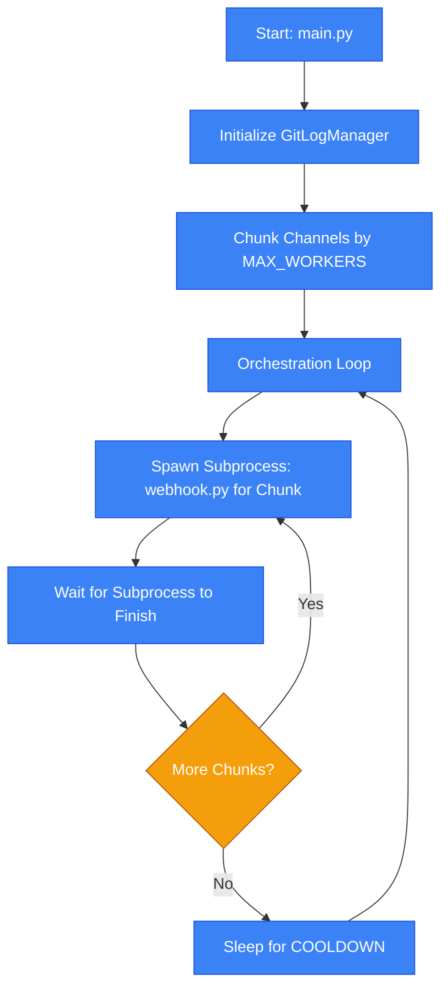

# Disgram

A Python-based application that scrapes public Telegram channels and forwards messages (text, images, videos, audio, documents) to Discord using modern Components V2 (Layouts).

## Features
- **Zero Account Setup**: Works out of the box using public Telegram preview pages.
- **Discord Components V2**: Beautiful layouts separating core content from metadata (e.g. timestamps, forwards).
- **Ephemeral Workers**: Optimized for low-memory environments like Render. Orchestrates scraping in isolated, short-lived chunks that automatically release memory.
- **Git Persistence**: Automatically commits and pushes log files back to GitHub, keeping state safely stored without needing a database.
- **Health & Monitoring**: Built-in Flask API with diagnostics (`/health`), soft/hard log cleanup (`/logs/clear`, `/logs/purge`), and Bearer Token protected administrative endpoints.
- **Telethon Integration (Optional)**: Provide Telegram API credentials for original, uncompressed media downloads, native file attachments, full long-text parsing, and hidden spoiler protection.

## Configuration

Duplicate `.env.example` to `.env` and set up your environment:
```bash
cp .env.example .env
```

**Core Environment Variables:**
- `DISCORD_WEBHOOK_URL`: Your target Discord webhook URL.
- `DISCORD_THREAD_ID`: (Optional) ID of a specific Discord thread to forward messages into.
- `SERVER_BOOST_LEVEL`: Your Discord Server Boost Level (1, 2, 3, or 4) to determine maximum file upload limits.
- `TELEGRAM_CHANNELS`: Comma-separated list of Telegram channel links. (Append `/123` to start from a specific message ID).
- `EMBED_COLOR`: Hex color code for Discord embeds (default: random).
- `API_BEARER_TOKEN`: Secret token used to secure administrative API routes.

**Performance & Scaling:**
- `MAX_WORKERS`: Number of concurrent workers (e.g., `2` for Render 512MB RAM).
- `DISGRAM_ENV`: Set to `production` to use Waitress instead of Flask dev server.

**Optional: Git Persistence**
- `USE_GIT`: Set to `true` to enable saving logs to GitHub.
- `GITHUB_REPO_URL`: The target repository URL to push logs to.
- `GITHUB_DEPLOY_BRANCH`: The branch to push logs to (default: `prod`).
- `GITHUB_TOKEN`: Your GitHub Personal Access Token (classic) with `repo` scope.
- *Alternatively, use GitHub App Auth (`GITHUB_APP_CLIENT_ID`, `GITHUB_APP_INSTALLATION_ID`, `GITHUB_APP_PRIVATE_KEY`)*.
- **Scheduling**: `COMMIT_MODE` (`interval` or `scheduled`). Use `LOG_COMMIT_INTERVAL` for interval seconds, or `COMMIT_SCHEDULE` (`hourly`, `every_2h`, `custom`) and `COMMIT_CUSTOM_HOURS` (e.g., `0,4,8,12`) for schedules. 
- `STARTUP_GRACE_PERIOD`: Cooldown in seconds before the first commit to prevent boot loops.

**Optional: Telethon Credentials (Best Quality)**
- `TG_API_ID` & `TG_API_HASH`: Get from [my.telegram.org/apps](https://my.telegram.org/apps).
- `TG_SESSION_STRING`: Run `python generate_session.py` locally to authenticate and generate this string.

## Quick Start

1. **Clone the repository:**
   ```bash
   git clone https://github.com/SimpNick6703/Disgram.git
   cd Disgram
   ```
2. **Install dependencies:**
   We recommend using `uv` for fast package management:
   ```bash
   curl -LsSf https://astral.sh/uv/install.sh | sh
   uv venv
   uv pip install -r requirements.txt
   ```
3. **Run the bot:**
   ```bash
   python main.py
   ```
   *(For Azure or production servers, you can also use `bash start.sh`)*

## Explanations

### Architecture & Memory Optimization
Disgram is designed to run stably on highly constrained environments (like Render's Free Tier with 512MB RAM). 
Instead of running infinite parallel loops, `main.py` acts as an orchestrator. It divides your Telegram channels into chunks and spawns sequential, single-pass `webhook.py` workers. Once a chunk finishes, memory is cleared via Garbage Collection (`gc.collect()`) before the next chunk starts.

### Unified Logging Architecture & `Disgram.log`
On ephemeral environments, local databases or log files disappear when the container sleeps. Disgram solves this by unifying all application logs and state into a single file: `Disgram.log`. 
This file acts as the single source of truth for tracking which messages have been sent. A background manager periodically commits and pushes this log to GitHub. Internal endpoints (`/logs/clear` for soft cleans, `/logs/purge` for hard cleans) or automatic overflow thresholds will periodically prune the file, discarding transient `INFO` system logs while permanently keeping your latest message markers safely preserved.

### 1. Subprocess Orchestration Diagram


```mermaid
graph TD
    Start[Start: main.py] --> InitGit[Initialize GitLogManager]
    InitGit --> ChunkChannels[Chunk Channels by MAX_WORKERS]
    ChunkChannels --> OrchestrationLoop["Orchestration Loop"]
    
    OrchestrationLoop --> SpawnChunk[Spawn Subprocess: webhook.py for Chunk]
    SpawnChunk --> WaitChunk[Wait for Subprocess to Finish]
    WaitChunk --> MoreChunks{"More Chunks?"}
    
    MoreChunks -- Yes --> SpawnChunk
    MoreChunks -- No --> Cooldown[Sleep for COOLDOWN]
    Cooldown --> OrchestrationLoop

    classDef proc fill:#3b82f6,stroke:#1d4ed8,color:#fff
    classDef decis fill:#f59e0b,stroke:#b45309,color:#fff
    class Start,InitGit,ChunkChannels,OrchestrationLoop,SpawnChunk,WaitChunk,Cooldown proc
    class MoreChunks decis
```

### 2. Scraper & Forwarding Pipeline Diagram


```mermaid
graph TD
    Startbot[Start Subprocess: webhook.py] --> Init[Initialize TelethonManager]
    Init --> ChannelLoop[Iterate Assigned Channels]
    
    ChannelLoop --> FetchTG[Fetch Telegram Preview via HTTP]
    FetchTG --> ParseTG{"New Message Found?"}
    ParseTG -- No --> NextChannel{"More Channels?"}
    
    ParseTG -- Yes --> ExtractMetadata["Extract Text, Forwards & Replies"]
    ExtractMetadata --> CheckTelethon{"Telethon Configured?"}
    
    CheckTelethon -- Yes --> CheckTelethonSize{"File Size <= Max?"}
    CheckTelethonSize -- Yes --> FetchTelethon["Fetch Media via Telethon"]
    CheckTelethonSize -- No --> MarkTooLarge["Skip DL: Mark video_too_large"]
    
    FetchTelethon --> MediaSuccess{"Telethon DL Succeeded?"}
    MarkTooLarge --> ProcessMedia["Process Media Items"]
    MediaSuccess -- Yes --> ProcessMedia
    
    CheckTelethon -- No --> CheckHTMLSize{"HTTP Content-Length <= Max?"}
    MediaSuccess -- No --> CheckHTMLSize
    
    CheckHTMLSize -- Yes --> HTMLFallback["Download Web Media Concurrently"]
    CheckHTMLSize -- No --> MarkTooLargeHTML["Skip DL: Mark video_too_large"]
    
    HTMLFallback --> ProcessMedia
    MarkTooLargeHTML --> ProcessMedia
    
    ProcessMedia --> BuildLayout["Build Discord Component V2 Layout"]
    BuildLayout --> SendWebhook[Send Webhook Message]
    
    SendWebhook --> Success{"Send Successful?"}
    Success -- Yes --> UpdateLog[Append to Disgram.log]
    UpdateLog --> MessageLoop{"More Messages in Channel?"}
    
    Success -- No (413) --> ApplyFallback[Targeted Video Fallback]
    ApplyFallback --> RetryWebhook[Retry Webhook]
    
    RetryWebhook --> SuccessFallback{"Retry Successful?"}
    SuccessFallback -- Yes --> UpdateLog
    SuccessFallback -- No --> PlainTextFallback[Plain Text Fallback]
    
    PlainTextFallback --> SuccessFinal{"Final Retry Successful?"}
    SuccessFinal -- Yes --> UpdateLog
    SuccessFinal -- No --> LogError[Log Error]
    LogError --> MessageLoop
    
    MessageLoop -- Yes --> ExtractMetadata
    MessageLoop -- No --> NextChannel
    
    NextChannel -- Yes --> ChannelLoop
    NextChannel -- No --> GCCollect["Run gc.collect() and Exit"]

    classDef loop fill:#10b981,stroke:#047857,color:#fff
    classDef decis fill:#f59e0b,stroke:#b45309,color:#fff
    classDef fallback fill:#ef4444,stroke:#b91c1c,color:#fff
    classDef telethon fill:#8b5cf6,stroke:#6d28d9,color:#fff
    
    class Startbot,Init,ChannelLoop,FetchTG,BuildLayout,SendWebhook,UpdateLog,RetryWebhook,PlainTextFallback,LogError,GCCollect loop
    class ParseTG,NextChannel,MessageLoop,Success,SuccessFallback,SuccessFinal,CheckTelethon,MediaSuccess,CheckTelethonSize,CheckHTMLSize decis
    class ApplyFallback,MarkTooLarge,MarkTooLargeHTML fallback
    class FetchTelethon,HTMLFallback,ProcessMedia telethon
```